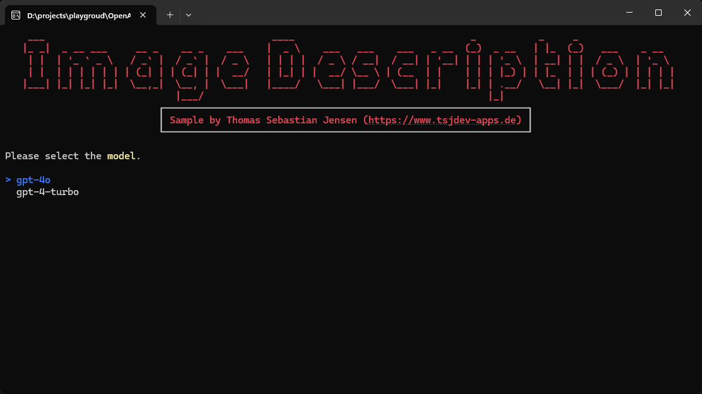
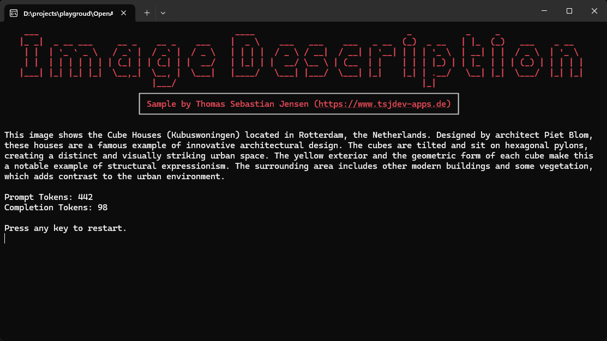
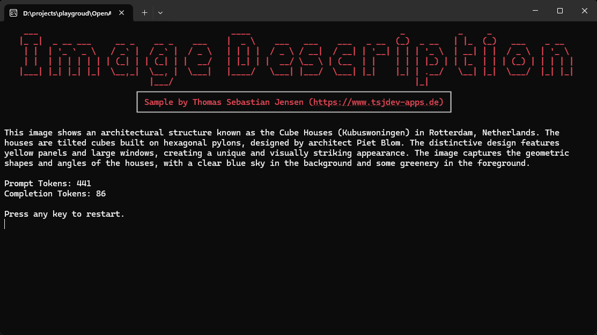

# Getting an image description using OpenAI Large Language Models

This repository contains a simple console application written in .NET 8 to demonstrate how to get an image description by using Large Language Models from [OpenAI](https://openai.com) and/or [Azure OpenAI](https://azure.microsoft.com/en-us/products/ai-services/openai-service) using the [Azure.AI.OpenAI](https://www.nuget.org/packages/Azure.AI.OpenAI/) NuGet package.

## Usage

You need to create an OpenAI account on this [website](https://platform.openai.com/docs/overview). You have to pay to use the API so make sure that you add your payment information. After that, you can create an API Key [here](https://platform.openai.com/api-keys) for further use. If you have access to an Azure OpenAI instance you can also use this instance for the demo application.

Just run the app and follow the steps displayed on the screen.

## Screenshots

Here you can see the console application in action:

First you need to select the host.

If you select *OpenAI* you need to select the used Large Language Model.

After providing a path to the picture file, you will get the image description and also the used tokens. Here is the sample using **GPT-4 Turbo**.

Here is the sample using **GPT-4o**.

## Blog Post

If you are more interested into details, please see the following posts on [medium.com](https://www.medium.com) or in my [personal blog](https://www.tsjdev-apps.de):

- [Getting an image description using GPT-4o or GPT-4 Turbo](https://medium.com/medialesson/getting-an-image-description-using-gpt-4o-or-gpt-4-turbo-e771e1b3f262)
- [Einrichtung von OpenAI](https://www.tsjdev-apps.de/einrichtung-von-openai/)
- [Einrichtung von Azure OpenAI](https://www.tsjdev-apps.de/einrichtung-von-azure-openai/)